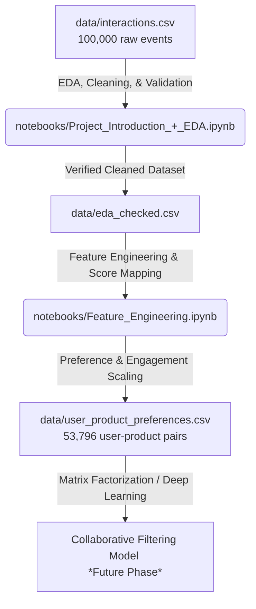

# 🛒 E-Commerce Recommendation System


<div align="center">
  
  [](https://www.python.org/)
  [](https://jupyter.org/)
  [](https://pandas.pydata.org/)
  [](https://numpy.org/)
  [](https://matplotlib.org/)

</div>

Modern e-commerce platforms feature vast product catalogs that users cannot possibly browse entirely. To optimize user experience and maximize conversion rates, this repository hosts an **end-to-end analytics and feature-engineering pipeline** for building an **implicit feedback-based E-Commerce Recommendation System**. 

Rather than relying on explicit star ratings, this pipeline converts implicit behavioral cues—such as page views, clicks, cart updates, and dwell times—into a structured User-Product Preference Matrix ready for collaborative filtering models.

---

## 🏗️ System Architecture & Data Flow

Below is the step-by-step pipeline from raw user events to recommendation-ready features:



---

## 📁 Repository Structure

```
E-Commerce-Recommendation-System/
├── assets/
│   └── banner.png                         # Project banner visual
├── data/
│   ├── interactions.csv                   # Raw user interaction events (100k rows)
│   ├── eda_checked.csv                    # Cleaned and parsed interaction dataset
│   └── user_product_preferences.csv       # Final user-product preference table
├── notebooks/
│   ├── Project_Introduction_+_EDA.ipynb   # Exploratory Data Analysis & cleaning
│   └── Feature_Engineering.ipynb          # Event scoring & preference generation
└── README.md                              # Modern documentation
```

---

## 📊 Datasets & Schema

The project handles three CSV datasets located in the `data/` folder:

### 1. Raw Interactions (`data/interactions.csv` & `data/eda_checked.csv`)
This contains 100,000 recorded customer events.

| Column Name | Data Type | Description |
| :--- | :--- | :--- |
| `interaction_id` | `object` (UUID) | Unique ID for each individual event. |
| `user_id` | `object` (UUID) | Unique identifier of the e-commerce customer. |
| `product_id` | `object` (UUID) | Unique identifier of the product. |
| `session_id` | `object` (UUID) | Session log session identifier. |
| `interaction_type` | `object` (Enum) | Action type: `view`, `click`, `add_to_cart`, `add_to_wishlist`, `remove_from_wishlist`, `remove_from_cart`. |
| `timestamp` | `object` -> `datetime64` | Date and time when the interaction took place. |
| `dwell_time_ms` | `int64` | Time duration user spent on the product page in milliseconds. |

### 2. Preference Matrix (`data/user_product_preferences.csv`)
The aggregated preferences output by the feature engineering stage.

| Column Name | Data Type | Description |
| :--- | :--- | :--- |
| `user_id` | `object` (UUID) | Unique user identifier. |
| `product_id` | `object` (UUID) | Unique product identifier. |
| `total_score` | `int64` | Cumulative sum of interaction weights. |
| `total_engagement` | `float64` | Cumulative sum of log-scaled dwell-time engagement scores. |
| `interaction_count` | `int64` | Number of events occurred for this user-product pair. |

---

## 🧠 Feature Engineering Methodology

Implicit feedback is often noisy. A user might view a product by mistake or purchase a product they didn't view for long. To solve this, two engineered scores are introduced:

### 1. Interaction Score ($W$)
Every interaction type is assigned a weight based on user intent strength:

| Event Type | Weight ($w_i$) | Description |
| :--- | :---: | :--- |
| **`add_to_cart`** | `+8` | Highest purchase intent indicator. |
| ****`add_to_wishlist`**** | `+5` | Strong direct preference indicator. |
| **`click`** | `+3` | Medium active interest. |
| **`view`** | `+1` | Passive exploration. |
| **`remove_from_wishlist`** | `-2` | Mild disinterest / rejection of a product. |
| **`remove_from_cart`** | `-3` | Explicit item rejection. |

$$Interaction\ Score = \sum w_i$$

### 2. Dwell-Time Engagement Score ($E$)
To account for user attention depth, the interaction score is scaled using log-normalized dwell time (in seconds):

$$t_{\text{seconds}} = \frac{\text{dwell\_time\_ms}}{1000}$$

$$Engagement\ Score = Interaction\ Score \times \ln(1 + t_{\text{seconds}})$$

> [!TIP]
> **Why natural log scaling ($\ln(1 + t)$)?**
> Natural log scaling compresses extreme dwell times (e.g. if a user leaves a tab open overnight and goes idle) while still rewarding sustained browsing compared to rapid, casual clicks.

---

## 📈 Dataset Statistics & EDA Insights

After executing the `Project_Introduction_+_EDA.ipynb` notebook, the following properties of the dataset were identified:

*   **Total Interaction Events**: `100,000`
*   **Active Customer Base**: `6,944` unique users
*   **Product Catalog Size**: `967` unique products
*   **Total Preference Profiles**: `53,796` unique user-product pair interactions generated

### Action Type Distribution:
*   👁️ **`view`**: `50,463` (50.5%)
*   🖱️ **`click`**: `19,983` (20.0%)
*   🛒 **`add_to_cart`**: `11,860` (11.9%)
*   ❤️ **`add_to_wishlist`**: `10,168` (10.2%)
*   💔 **`remove_from_wishlist`**: `4,795` (4.8%)
*   🗑️ **`remove_from_cart`**: `2,731` (2.7%)

---

## 🚀 Getting Started

Follow these steps to run the analysis and feature engineering:

### 1. Clone the repository
```bash
git clone https://github.com/mohamedchargui75-jpg/E-Commerce-Recommendation-System.git
cd E-Commerce-Recommendation-System
```

### 2. Set Up Environment & Dependencies
Create a virtual environment and install the required numerical libraries:
```bash
python -m venv venv
source venv/bin/activate  # On Windows: venv\Scripts\activate
pip install pandas numpy matplotlib jupyter
```

### 3. Run the Pipeline Notebooks
Start the Jupyter environment to explore or re-run the notebooks:
```bash
jupyter notebook
```
1. Run `notebooks/Project_Introduction_+_EDA.ipynb` first to validate the raw dataset and export `data/eda_checked.csv`.
2. Run `notebooks/Feature_Engineering.ipynb` next to engineer the behavioral/engagement weights and generate the final `data/user_product_preferences.csv` table.

---

## 🗺️ Roadmap & Next Steps
- [ ] **Collaborative Filtering Model Implementation**: Implement Matrix Factorization techniques like Singular Value Decomposition (SVD) or Alternating Least Squares (ALS) using libraries like `implicit` or `surprise`.
- [ ] **Content-Based Filtering**: Enrich the model by combining user preferences with product metadata (categories, descriptions).
- [ ] **Real-Time Recommendation API**: Deploy a FastAPI microservice serving recommendations based on active session states.
- [ ] **Hybrid Recommender System**: Combine collaborative and content-based recommendation scores to mitigate the cold-start problem.
